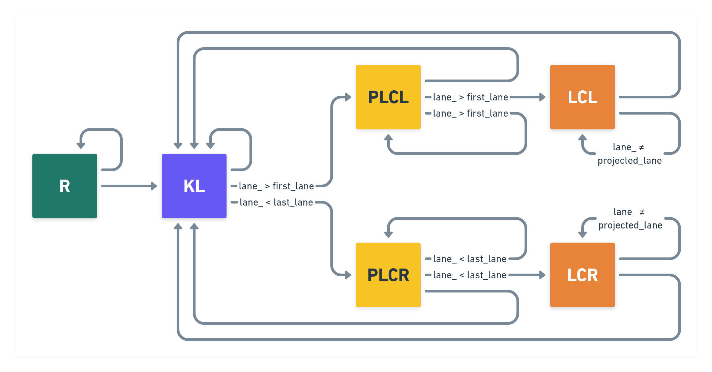
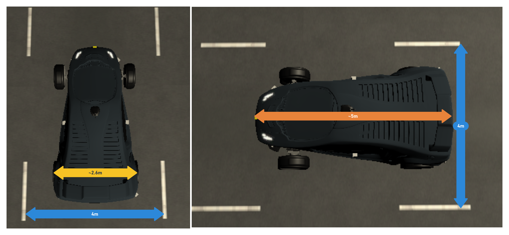
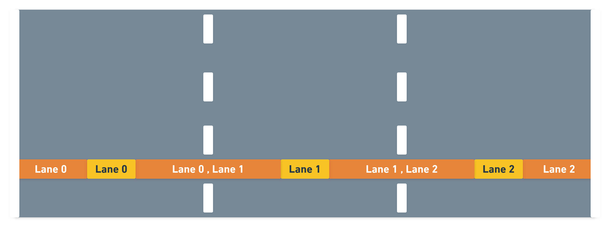
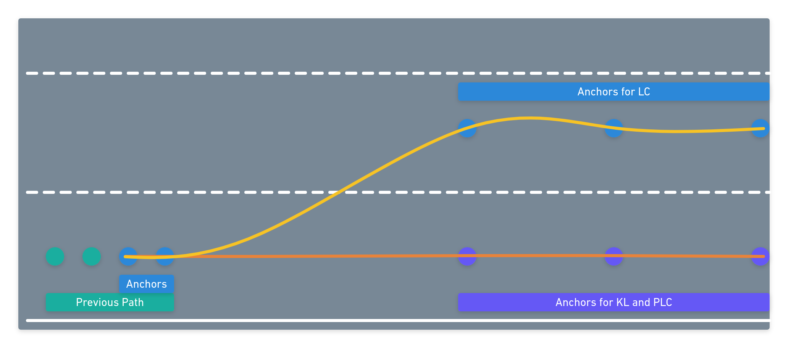
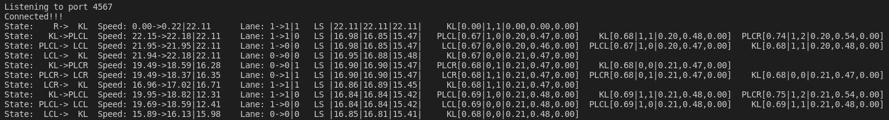

# CarND-Path-Planning-Project


This project implements a Path Planner for a simulated self-driving  car on a highway. The program communicates with the Udacity Term3 Simulator, which sends telemetry data to the path planner program and receives back the next best trajectory points that the car has to follow.

The Path Planning Project is part of the Self-Driving Car Engineer Nanodegree Program.

A video with this program running over 10 miles without any incident is available [here](https://youtu.be/0Hi2Q17JVDY) on my youtube channel.

## Table of Content
<!--ts-->
  * [Dependencies](#dependencies)
  * [Installation](#installation)
    * [Simulator](#simulator)
  * [Usage](#usage)
  * [Simulation](#simulation)
    * [Goals](#goals)
    * [Communication](#communication-between-path-planner-and-the-simulator)
    * [The Highway Map](#the-highway-map)
  * [Path Planner Strategy](#path-planner-strategy)
    * [Data Received from Simulator](#data-received-from-simulator)
    * [Sensor Fusion and Predictions](#sensor-fusion-and-predictions)
    * [Finite State Machine](#finite-state-machine)
    * [Trajectory Generation](#trajectory-generation)
    * [Trajectory Cost](#trajectory-cost)
    * [Best Trajectory Selection](#best-trajectory-selection)
    * [Statistics](#statistics)
    * [Data Sent Back to Simulator](#data-sent-back-to-simulator)
  * [C++ Classes Structure](#c-classes-structure)
    * [States](#states)
    * [Trajectory Class](#trajectory-class)
    * [Vehicle Class](#vehicle-class)
    * [Helper Functions](#helper-functions)
  * [Next Features](#next-features-to-be-implemented)
  * [License](#license)
  * [References](#references)
<!--te-->

## Dependencies

* cmake >= 3.5
  * All OSes: [click here for installation instructions](https://cmake.org/install/)
* make >= 4.1
  * Linux: make is installed by default on most Linux distros
  * Mac: [install Xcode command line tools to get make](https://developer.apple.com/xcode/features/)
  * Windows: [Click here for installation instructions](http://gnuwin32.sourceforge.net/packages/make.htm)
* gcc/g++ >= 5.4
  * Linux: gcc / g++ is installed by default on most Linux distros
  * Mac: same deal as make - [install Xcode command line tools]((https://developer.apple.com/xcode/features/)
  * Windows: recommend using [MinGW](http://www.mingw.org/)
* [uWebSockets](https://github.com/uWebSockets/uWebSockets)
  * Run either `install-mac.sh` or `install-ubuntu.sh`.
  * If you install from source, checkout to commit `e94b6e1`, i.e.
    ```
    git clone https://github.com/uWebSockets/uWebSockets 
    cd uWebSockets
    git checkout e94b6e1
    ```

# Installation

Just clone this repository and build it using `make build`. Assuming that you will clone this repository at `~/`:

```shell
cd ~/
git clone https://github.com/rodriguesrenato/CarND-Path-Planning.git
cd CarND-Path-Planning
make build
```

## Simulator

You can download the Term3 Simulator which contains the Path Planning Project from the [releases tab](https://github.com/udacity/self-driving-car-sim/releases/tag/T3_v1.2).  

To run the simulator on Mac/Linux, first make the binary file executable with the following command:

```shell
sudo chmod u+x {simulator_file_name}
```

# Usage

This project uses Make. The Makefile has four targets:

- `build` compiles the source code and generates the `path_planning` executable.
- `format` applies ClangFormat to style the source code in [Google's C++ style](https://google.github.io/styleguide/cppguide.html).
- `debug` compiles the source code and generates an executable, including debugging symbols
- `clean` deletes the build/ directory, including all of the build artifacts
- `run` executes the `path_planning`

These are the steps to run this project:

1. Go to the project directory
2. Run `make build`. This will create an executable `path_planning` at build directory. The same applies for `make debug`.
3. Run `make run` to execute the `path_planning`.
4. Open a new terminal, go to the simulator folder and run `./{simulator_file_name}` to start it.

In the Simulator, hit `Select` button to start the simulation along with `path_planning`

# Simulation

## Goals

In this project the goal is to safely navigate around a virtual highway with other traffic that is driving +-10 MPH of the 50 MPH speed limit. The simulator provides the car's localization and sensor fusion data, and there is also a sparse map list of waypoints around the highway. The car should try to go as close as possible to the 50 MPH speed limit, which means passing slower traffic when possible, and other cars will try to change lanes too. The car should avoid hitting other cars at all cost as well as driving inside of the marked road lanes at all times, unless going from one lane to another. The car should be able to make one complete loop around the 6946m highway. Since the car is trying to go 50 MPH, it should take a little over 5 minutes to complete 1 loop. Also the car should not experience total acceleration over 10 m/s^2 and jerk that is greater than 10 m/s^3.

## Communication between Path Planner and the Simulator

For this project, Udacity provided a starter c++ code with the websocket communication framework to handle messages received from the simulator (Localization, sensor fusion and previous path data) and send back messages to it (The next path). Udacity also provided a set of conversion functions between XY and Frenet Coordinates, and the `highway_map.csv` that contains a sparse map list of waypoints around the highway.

Here is the data received from the Simulator to the C++ Program

| JSON message key | Description |
|---|---|
| ["x"] | The car's x position in map coordinates|
| ["y"] | The car's y position in map coordinates|
| ["s"] | The car's s position in frenet coordinates|
| ["d"] | The car's d position in frenet coordinates|
| ["yaw"] | The car's yaw angle in the map|
| ["speed"] | The car's speed in MPH|
| ["previous_path_x"] | The remaining previous list of x points previously given to the simulator |
| ["previous_path_y"] | The remaining previous list of y points previously given to the simulator |
| ["end_path_s"] | The previous list's last point's frenet s value|
| ["end_path_d"] | The previous list's last point's frenet d value|
| ["sensor_fusion"] | A 2d vector of all other car's attributes on the same side of the road: [car's unique ID,car's x position in map coordinates, car's y position in map coordinates, car's x velocity in m/s, car's y velocity in m/s, car's s position in frenet coordinates, car's d position in frenet coordinates. |

Note: In the remaining previous list received, the processed points were removed.

Here is the data sent from the Simulator to the C++ Program

| JSON message key | Description |
|---|---|
| ["next_x"] | A list of x points that will be the next path |
| ["next_y"] | A list of y points that will be the next path |

The car uses a perfect controller and will visit every (x,y) point it receives in the list every .02 seconds. The units for the (x,y) points are in meters and the spacing of the points determines the speed of the car. The vector going from a point to the next point in the list dictates the angle of the car. Acceleration both in the tangential and normal directions is measured along with the jerk, the rate of change of total Acceleration. The (x,y) point paths that the planner receives should not have a total acceleration that goes over 10 m/s^2, also the jerk should not go over 50 m/s^3. (NOTE: As this is BETA, these requirements might change. Also currently jerk is over a .02 second interval, it would probably be better to average total acceleration over 1 second and measure jerk from that.

There will be some latency between the simulator running and the path planner returning a path, with optimized code usually it is not very long, maybe just 1-3 time steps. During this delay the simulator will continue using points that it was last given, because of this it is a good idea to store the last points you have used so you can have a smooth transition. previous_path_x, and previous_path_y can be helpful for this transition since they show the last points given to the simulator controller with the processed points already removed. You would either return a path that extends this previous path or make sure to create a new path that has a smooth transition with this last path.

## The Highway Map

The map of the highway is in `data/highway_map.txt`. Each waypoint in the list contains  [x,y,s,dx,dy] values. x and y are the waypoint's map coordinate position, the s value is the distance along the road to get to that waypoint in meters, the dx and dy values define the unit normal vector pointing outward of the highway loop.

The highway's waypoints loop around so the frenet s value, distance along the road, goes from 0 to 6945.554.

# Path Planner Strategy 

The highway is a structured environment, with predefined rules as traffic direction, lane boundaries and speed limits. The solution takes the advantage of this to define the global goals and which cost functions would be important to be implemented.

As a road position or lane isn't defined as a goal, the planner should consider checking the speed of any valid lane. The main goal is to keep the vehicle as fast as possible on the road, at maximum allowed speed on the road.

Two classes were created to keep the planner organized and help evaluating each path: `Vehicle` and `Trajectory`. These classes are detailed at C++ Program Structure section.

An instance of the `Vehicle` car is created and configured at the beginning of the program with the road, car and trajectory parameters, named as `main_car`, which will be used on each event of message received from the Simulator.

On each message received from the simulator with new localization / sensor fusion data, the path planner will compute the best path for the car to achieve the goals. These are the main steps done by the path planner:

1. Update the current localization and sensor fusion data
2. Get a vector of all successor States from the finite state machine.
3. For each successor State, generate the correspondent Trajectory, calculate the total cost and add it to a vector of possible trajectories.
4. Get the trajectory with the lowest cost and send it back to the simulator.


## Data Received from Simulator

When the Simulator sends an telemetry message to the `path_planning` program, the `main_car` updates the localization, previous path and sensor fusion data received.

## Sensor Fusion and Predictions

The sensor fusion data is preprocessed by the `PredictSensorFusion()` member function of the `Vehicle` class. This function receives a `buffer_size` as argument, which will be used as time length to compute the predictions. For each vehicle in the sensor_fusion data, the speed magnitude is calculated to estimate the final `s` position of the vehicle. A vector of `id`, `s`,`final_s`, `d` and `final_speed` for each vehicle is built and added to the predictions vector. 

The private attribute `predictions_` is a dictionary that keeps the calculated predictions vectors for each requested buffer size in order to avoid unnecessary recalculations.


## Finite State Machine

The next step is to get a list of the successor States according to the finite state machine implemented.

A `Vehicle` can have 4 possible behaviours:

- Ready [R]: Stopped, ready to start.
- Keep Lane [KL]: Drive ahead in the same lane.
- Prepare Lane Change [PLC]: Prepare for a lane change.
- Lane Change [LC]: Change to the next lane.

The PLC and LC can be oriented to right [R] or left [L], which results in 6 possible states for a vehicle: R, KL, PLCL, PLCR, LCL and LCR. These states are defined by the `State` enumerator in the `states.h` file. 

The diagram below represents the finite state machine (FSM) implemented:



As it isn't allowed counterflow and off road driving, the FSM automatically skips the states that would result in these conditions by testing the current lane. 

## Trajectory Generation

For each State in the list of successor states, the respective `Trajectory` is built, the costs are calculated and the trajectory is added to a vector of trajectories. 

Before building a `Trajectory`, there are some parameters that have to be specified: `Target Lane`, `Trajectory Buffer Size` and `Trajectory S Projection`.

The `Target Lane`, calculated by the `CalculateBestLane()` member function, is the closest lane with the highest lane speed, according to the side of the given state. For the `KL` state, the target lane is the same as the current lane.

The lane speed, calculated by the `CalculateLaneSpeed()` member function, iterates over each prediction of other vehicles in the desired lane to get the slowest vehicle speed that will be within the `s` projection distance ahead the `main_car`.

The `Trajectory Buffer Size` defines the number of the Trajectory x and y points. As the Simulator executes each point in 0.02 seconds, this buffer size is defined as `50` to keep the trajectory in a range of `1 second`.

The `Trajectory S Projection` defines how far the trajectory will be projected. When there is a lane change state (LCL or LCR), the S projection is extended by 20% to generate a smoother lane change.

The `Trajectory Buffer Size` and `Trajectory S Projection` were defined at the `main_car` constructor.

At this point, with the target parameters defined, the requested Trajectory can start to be built. Each trajectory has a projected lane and a target lane according to its requested state.

The **first step** is to check which lanes this trajectory will have to find the safe speed and then take the slowest one.
 
The vehicle length and width have to be considered. These measurements were estimated relative to the distance between lanes lines, as shown in the image below. The values considered were 5m in length and 3m in width.



When changing lanes, the vehicle has to follow the lowest speed ahead conforming to it's `d` position. When the vehicle is not in the center of the lane, it has to check all lanes that any part of the vehicle is, according to the vehicle width. As the lane is 4m wide and the vehicle width is considered 3m, it lasts a 1m range that will be centered in the lane. This range is where the vehicle will be considered only in this lane, otherwise the vehicle is considered between 2 lanes.

The image below shows which lanes the vehicle has to check, according to it's `d` position.



The `main_car` has to maintain a safe distance when there is a vehicle ahead and/or behind. When the `main_car` is less than the safe distance away from the car ahead, its speed will be multiplied by a simple proportional gain. This gain reduces the speed by the relation between distance from the vehicle ahead and the safe distance ahead. This adjustment on speed is done for each lane that will be checked.

If there is a vehicle ahead and another vehicle behind on the same lane, it will follow the speed of the vehicle ahead.

The final speed that will be used to compute the trajectory will be the slowest speed of the checked lanes.

The **second step** is to define the `projected_lane`, which is the lane that will be used as the final lane of the current trajectory. For `KL` and `PLC`, it is the current lane. For `LC`, it is just one lane to the chosen side. `target_lane` can be more than 1 lane because it only indicates the lane with the highest speed and `project_lane` is where the trajectory will be set, so in this way the planner is not allowed to cross more than one lane at once.

The **third step** is to define the number of XY coordinates from the previous path that will be used to build the current trajectory. If the path would not have an abrupt change of direction or speed, it is reasonable to keep the previous path and build new points from the end of it. On the other hand, if it detects an abrupt change of the current speed to the new final speed, or a `LC` state, the path planner will take only 20% of the previous path. It will improve the continuity of the path, minimizing jerk.

The **fourth step** is to define a spline with five anchor points.



The first two anchor points will be the last 2 points of the previous path. If the previous path is empty, the current position and a point projected behind it will be used. 

These two anchor points will be used as the x, y and yaw reference to build the new trajectory from the spline. 

The last 3 anchor points will be at the `projected_lane` and distancing from the current `s` position by 1.0, 1.5 and 2.0 times the `trajectory_s_projection` variable defined previously. Thereafter, these coordinates are converted to XY coordinates.

These 5 anchor points will be shifted to 0 degrees from the yaw reference and translated from the x and y reference in order to help in the further calculations with the spline, which would avoid a spline with multiple y values for the same x value. 

The **fifth step** is to check the chosen speed and update it for this trajectory. The remaining trajectory XY points will be calculated on a fixed velocity. 

If the chosen speed is greater than the speed limit, then set it as the speed limit. Next, it will check if it has to accelerate or decelerate:

- If it is greater than the final speed of the previous trajectory, then add 0.244 meter per second to the previous trajectory and use it as the current trajectory speed. 
- If it is less than the final speed of the previous trajectory, then subtract 0.244 meter per second to the previous trajectory and use it as the current trajectory speed.

The **sixth step** is to calculate new XY trajectory points with the new trajectory final speed until the trajectory gets the number of points given by the `trajectory_buffer_size` variable.

The trajectory length in `s` was given by the `trajectory_s_projection` variable and the corresponding y value is calculated with the spline, then the projection distance from the beginning to this projection point is calculated. 

As the simulator runs at a fixed time step of 0.02s and the remaining trajectory points will be calculated at fixed speed, the distance driven for each time step is fixed too and calculated by `time_step * new_trajectory_speed`. Dividing the projection distance by the distance driven for each time step will result in the number `N` of time steps needed to reach the projection distance at this speed.

The `trajectory_s_projection` is divided by `N` to result in the desired distance step in the x axis to reach the projection distance.

At this point, the new trajectory already has points from the **third step** and new XY points will be calculated until the trajectory reaches the size defined by `trajectory_buffer_size`. It will set the next x value (previous + distance step), calculate the y value with the spline function, rotate and translate them back with the x, y and yaw references, and then add the new XY points to the trajectory vector.

The **seventh step** is to define the class attributes of the trajectory with the values calculated on this process. These attributes will be used in the future to calculate the trajectory cost and update the `Vehicle` class before the best trajectory is chosen.

## Trajectory Cost

After the trajectories are built, the total cost for each trajectory is calculated. There were implemented 3 cost functions, which costs values ranges from 0 to 1:

The `Speed Cost` function calculates the cost of the trajectory target speed. 
- The cost is maximum of `1` when the speed is beyond the road speed limit and negative (backward not allowed).
- The vehicle `speed limit` is defined by the `road_speed_limit - speed_buffer` and it represents the minimum cost of `0`.
- if the `target_speed` is lower than the `speed_limit`, the cost will decrease linearly from `0.8` at `0 speed` to `0` at `speed_limit`.
- if the `target_speed` is between the `speed_limit` and the `road_speed_limit`, the cost will increase linearly from `0` at `speed_limit` to `1` at `road_speed_limit`.

The `Lane Change Cost` (also known as Inefficiency Cost) function calculates the difference of the `speed_limit` with the project and target lane speeds, summing up both differences and dividing it by 2 times the `speed_limit` to result in a cost between 0 and 1.

The `Collision Cost` function checks if the vehicle will collide with other vehicles in the future and returns a binary cost of `0` or `1`. The vehicle length is used to define thresholds of `s` positions on the initial and final positions to check for collisions on the trajectory `projected lane`. 

There are 5 collision conditions that are checked:

1. Check if there is a car besides.
2. Check if there will be a vehicle in the end path position.
3. Check the case where there is a vehicle too fast passing in that lane.
4. Check the case where there is a vehicle too slow passing in that lane.
5. Check the case where there is a vehicle at the middle of the trajectory, between the initial and final position.

Each cost function has its own cost weight, which is defined right after the `main_car` object is instantiated. The `total cost` is the sum of each cost multiplied by its respective weight. After tuning weight values, the `Speed Cost` weight is `1.0`, the `Lane Change Cost` weight is `1.1` and the `Collision Cost` weight is `100`.

## Best Trajectory Selection

Each generated trajectory is added to a vector of `Trajectory` after the costs are calculated. This vector is sorted by the total cost in the ascending order and the trajectory with the lowest total cost is chosen as the best trajectory.

The best trajectory is passed to the `main_car` to update the previous trajectory attributes, the ones used to build the next trajectory.

## Statistics



A print function was implemented to keep tracking of the most important `Vehicle` attributes and path planning parameters. The vector of trajectories is also passed as reference to show each cost and projected/target lanes.

This function prints the whole statistic in one line and there are **five** main sections:

- **State**: `Previous Trajectory State` -> `Current Best Trajectory State`
- **Speed**: `Current Speed` -> `Best Trajectory Projected Speed` | `Target Speed`
- **Lane**: `Current Lane` -> `Projected Lane` | `Target Lane`
- **LS (Lanes Speeds)**: | `Lane 0 Speed` | `Lane 1 Speed` | `Lane 2 Speed` |
- **Possible Trajectories vector sorted by costs**: 
  - Each Trajectory have the following pattern:
  `State`[`Total Cost`|`Projected Lane`,`Target_lane`|`SpeedCost`,`LaneChangeCost`,`CollisionCost`]


## Data Sent Back to Simulator

Finally, the best trajectory vectors of XY points are set in a JSON message to be sent back to the simulator.

# Results

A video of this project running over 10 miles without any incident is available [here](https://youtu.be/0Hi2Q17JVDY).

The `main_car` could drive safely and change lanes when the traffic ahead is slow. Using the definition of target lane and project lane worked well to make the vehicle change only one lane at time. 

Sometimes when there are vehicles in all lanes, the `main_car` might keep changing lanes until it finds a path to overtake the traffic ahead. When the lane change cost weight is increased to avoid the mentioned behaviour, the `main_car` used to keep in a slower lane when the target lane is not the lane beside it.

As the `main_car` could drive without any incident with these cost weights and could drive safely on the highway, the goals of this project were achieved.

# C++ Classes Structure

The `Vehicle` and `Trajectory` class were designed to keep this project code clean and organized. This structure makes it possible to track some previous trajectory parameters to create a smooth transition on the next one.

## States

The possible states of the finite state machine were defined as the `State` enum in the file `states.h`

There are 6 defined states:
- `R`: Ready
- `KL`: Keep Lane
- `PLCL`: Prepare Lane Change Left
- `LCL`: Lane Change Left
- `PLCR`: Prepare Lane Change Right
- `LCR`: Lane Change Right

## Trajectory Class

The Trajectory class is a simple class of public attributes that keeps all relevant information about the path. These attributes are mainly used to calculate the trajectory costs and to update the `Vehicle` class attributes. The XY points of the coordinates are stored in vectors which will be used to send it back to the simulator.

## Vehicle Class

The `Vehicle` class is the main class responsible for unifying information of the vehicle, sensor fusion, the road and states. The speeds given in mph are converted to meters per second before getting assigned to class attributes or used by methods. 

It contains the methods explained in the section `Path Planner Strategy` to calculate lanes, speeds, build trajectories, calculate costs and print statistics.

## Helper Functions

The `helpers.h` file contains conversion functions between XY and Frenet coordinates. This header file is used by the `Vehicle` class.

# Next Features

- Record a full simulation and post on youtube.
- Handle the case where the last 2 positions of the previous path are the same (when speed near 0).
- Numerical validation on Vehicle Constructor (Avoid 0 values) and break it in more member functions.
- Use `LanesToCheckSpeed` logic to the `CalculateLaneIndex` function to get when a vehicle from sensor fusion is changing lanes.
- Add VSCode profiler.
- Generate gifs of each car maneuver.

# License

The contents of this repository are covered under the MIT License.

# References

- Udacity Path Planning Project start guide repository. [link](https://github.com/udacity/CarND-Path-Planning-Project)
- C++ Reference. [link](http://cplusplus.com)
- Cubic Spline interpolation in C++: [spline.h](http://kluge.in-chemnitz.de/opensource/spline/)